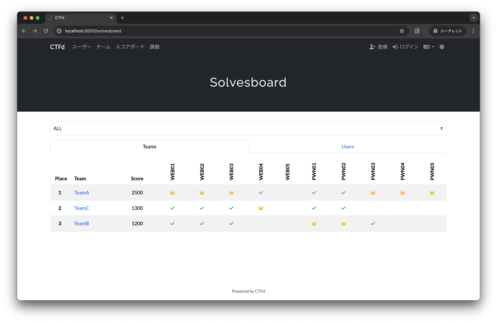

# CTFd-solvesboard-plugin

A CTFd plugin to view who solved which challenges, including first bloods, at a glance.



## Installation

Follow these steps to install the plugin:

1. **Clone the repository into your CTFd plugins directory.**

   ```
   git clone https://github.com/chakumma/CTFd-solvesboard-plugin.git /path/to/your/CTFd/plugins/solvesboard/
   ```

2. **Restart your CTFd instance.**

## Usage

Once installed, navigate to the `/solvesboard` page on your CTFd instance to view the board.
